<p align="center">
  
</p>

<h1 align="center">MUTAGENT</h1>

<p align="center">
  <b>The Agentic Development Lifecycle</b> — build · evaluate · diagnose · improve AI agents, all from one conversational orchestrator.
</p>

<p align="center">
  
  
  
  
</p>

---

## 🏆 The Hackathon Challenge

**Build & evaluate the most sophisticated AI agent you can** — end-to-end through the Mutagent
framework, in any harness or framework (Mastra · LangGraph · Claude Code · Codex · …). Run the loop
`*spec → *build → *evaluate` and **prove it works** with a real eval set. The more ambitious and
capable the agent — real jobs, tools, integrations, triggers — the better.

> 🏆 **Bonus — Extend the Lifecycle:** add a new ADL stage / `*command` / skill that cleanly fits Helix.

**Judging**
1. **Sophistication of the agent** *(headline)* — ambition & complexity: jobs, tools, triggers, real integrations.
2. **Loop completeness** — `*spec → *build → *evaluate` end-to-end (`*diagnose → *improve` rounds count for more).
3. **Proof it works** — eval criteria + a real dataset (≥ 20 items) + a scorecard.
4. 🏆 **Framework extension** *(bonus)* — does your new command/stage work + fit the system?

**Delivery**
- **Agent code** left on this `mutagent-hackathon` codebase.
- **Orchestrator (Helix) + subagent session transcripts — required.** They *are* your submission: both framework feedback and proof you used the system.

> 📖 Full walkthrough in **[`QUICKSTART.md`](./QUICKSTART.md)** · printable deck: **[`quickstart.pdf`](./quickstart.pdf)**.

---

## What is MutagenT?

MutagenT drives a skill or agent through the **Agentic Development Lifecycle (ADL)** — a loop you
steer in plain language. You describe an agent and it gets **spec'd, built, evaluated, diagnosed, and
improved**, with you in control at every gate. One orchestrator (**Helix**) routes each stage to a
specialized subagent; nothing auto-advances, and every apply is approval-gated.

```
① SPEC ──▶ ② BUILD ──▶ ③ EVALUATE ──▶ ④ DIAGNOSE ──▶ ⑤ IMPROVE ──┐ ↺
   ▲────────────────────────────────────────────────────────────┘
   enter at any stage · transitions are explicit · the EDD inner loop runs until the gate passes
```

<p align="center"></p>

---

## Key Features

- **One orchestrator, many subagents** — `Helix` sequences `spec → build → evaluate → diagnose → improve` and routes each stage to its owning skill. It conducts; it never does the stage's inner work.
- **Spec → impl, one direction** — a guided interview emits a portable `agentspec.yaml`; `*build` implements it into your chosen target and a reviewer checks the result actually matches the spec.
- **Eval-driven development** — mine criteria, build a dataset, and judge real runs into a **binary pass/fail scorecard**; failures route to diagnosis. The judge only judges — it never silently fixes.
- **Two eval substrates** — a built-in host-runtime judge *(no provider key)*, or an exported **code eval suite** (deterministic checks + LLM-as-judge) that runs in your own stack/CI.
- **Diagnose → improve, gated** — root-cause with ranked fixes; an AI engineer applies the chosen one and re-evaluates, looping until green. **Nothing changes without your go-ahead.**
- **Any harness** — Mastra, LangGraph, or coding-agent harnesses like Claude Code / Codex.
- **Conversational + explicit** — type a `*command`, or just say what you want. Free text routes; gates hold.

---

## Quick Start

```bash
# 1 · clone
git clone <this-repo> mutagent-hackathon && cd mutagent-hackathon

# 2 · install the system  (agents + skills → .claude/ and .codex/)
bunx @mutagent/helix init        # or: npx / pnpx

# 3 · boot
claude            # or codex
> mutagent
```

`mutagent` boots **Helix** — the ADL dashboard, the system map, and the command roster:

```
🧬  MUTAGENT · ADL Orchestrator — Helix routes to your subagents
  LIFECYCLE   ① SPEC → ② BUILD → ③ EVALUATE → ④ DIAGNOSE → ⑤ IMPROVE
  SYSTEM      agentspec · skill-builder · evaluator · diagnostics
  SETUP       ⚠ not onboarded yet — run *onboard
  COMMANDS    *spec  *build  *evaluate  *diagnose  *onboard  *status
```

---

## The Commands

| Command | Stage | What it does | You get |
|---|---|---|---|
| `*onboard` | setup | add provider keys · workspace · models | a config |
| `*spec` | ① | guided interview → a portable spec | `agentspec.yaml` |
| `*build` | ② | implement the spec into your target + verify | a working agent + report |
| `*evaluate` | ③ | judge real runs → pass/fail per behavior | a scorecard |
| `*diagnose` | ④ | root-cause the failures → ranked fixes | a diagnosis report |
| *(improve)* | ⑤ | apply the fix, re-evaluate — gated | updated agent + fresh scorecard |

Don't know the name? Just say it: *"design a new agent that triages our support inbox"*,
*"evaluate the agent on its last 50 runs"*, *"why did it fail its escalation eval?"* — Helix routes it.

---

## Repo Layout

```
mutagent-hackathon/
├── README.md            ← you are here
├── QUICKSTART.md        ← the full 7-stage guide
├── quickstart.pdf       ← printable, branded deck
└── .claude/             ← the Mutagent system (agents + skills) — installed by *helix init*
```

---

## License

Proprietary — © MutagenT. All rights reserved.
