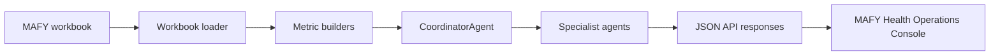

# MAFY Agent Service

Bun service for the MAFY Health Operations Console. It loads the sensitisation workbook, derives operational metrics, runs agent workflows, anonymizes sensitive data, and serves structured payloads to the MAFY workspace.

## Role In The System



The service is designed to work without an LLM key. Deterministic scoring, action generation, anonymization, and Monte Carlo forecasting still run locally. When `OPENAI_API_KEY` is configured, the LLM improves rationale and report language from anonymized aggregate payloads.

## Commands

```bash
bun install
bun run dev
bun run typecheck
bun run anonymize
```

## Environment

Create `backend/.env` for local secrets and configuration:

```text
PORT=8787
CORS_ORIGIN=http://127.0.0.1:5173
DATASET_PATH=../data/SENSIBILISATION_STAFFDFM_MAFY-2026-06-27.xlsx
OPENAI_API_KEY=your_key_here
OPENAI_MODEL=gpt-4.1-mini
```

Keep real keys in `backend/.env`. Do not commit secrets.

## API Routes

| Method | Route | Purpose |
| --- | --- | --- |
| `GET` | `/health` | Service health and LLM availability. |
| `GET` | `/api/agents` | Lists coordinator and specialist agents. |
| `GET` | `/api/dataset/summary` | Returns workbook summary, top sites, top communes, and monthly metrics. |
| `GET` | `/api/dataset/anonymization-report` | Returns an anonymization coverage report. |
| `GET` | `/api/dataset/anonymized` | Returns anonymized rows for review or external testing. |
| `POST` | `/api/agents/run` | Generic coordinator entry point. |
| `POST` | `/api/operations/follow-up` | Runs current follow-up operations workflow. |
| `POST` | `/api/forecast/what-if` | Runs Monte Carlo what-if forecast workflow. |
| `POST` | `/api/reports/detailed` | Runs detailed report workflow for downloadable exports. |

## Agent Operations

Supported coordinator operations:

```text
full-review
data-quality
outreach-load
referral-score
risk-intensity
follow-up-operations
what-if-forecast
report
```

Example:

```json
{
  "operation": "what-if-forecast",
  "options": {
    "scenarioId": "followup-delay",
    "horizonMonths": 6,
    "iterations": 1200,
    "limit": 6,
    "includeRationale": true
  },
  "language": "en"
}
```

## Sub-Agent Workflows

| Workflow | Sub-agents | Output |
| --- | --- | --- |
| Follow-up operations | `OperationsTriageAgent`, `OperationsRationaleAgent` | Assignable actions with evidence, owners, due windows, blockers, and rationale. |
| What-if forecast | `MonteCarloParameterAgent`, `ScenarioMonteCarloAgent`, `ForecastRationaleAgent` | P10/P50/P90 trajectories, race frames, drivers, and scenario rationale. |
| Report generation | Specialist outputs plus `ReportAgent` | Executive summary, findings, chart data, operations queue, and export payload. |

## Anonymization

Before any LLM-facing payload is built, direct identifiers and high-risk fields are removed, minimized, or pseudonymized. This includes raw GPS strings, exact timestamps, staff names, usernames, form links, raw observations, raw participant questions, and direct record identifiers.

Generate anonymized files:

```bash
bun run anonymize
```

Generated files are written under:

```text
data/anonymized/
```

That directory is ignored by git.

## More Documentation

- [`../docs/AGENTIC_INFRASTRUCTURE.md`](../docs/AGENTIC_INFRASTRUCTURE.md)
- [`../docs/OPERATIONS_OVERVIEW.md`](../docs/OPERATIONS_OVERVIEW.md)
- [`../README.md`](../README.md)
