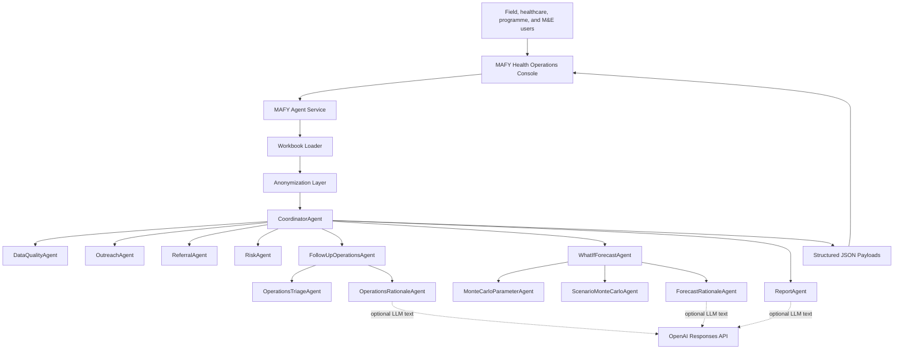
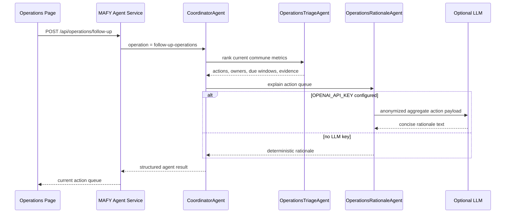
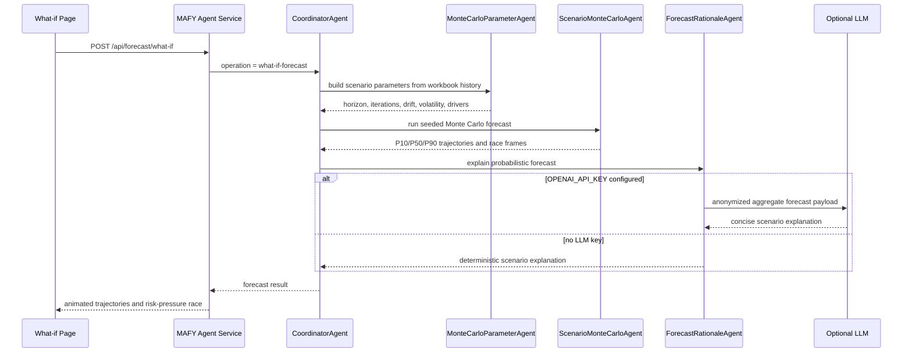
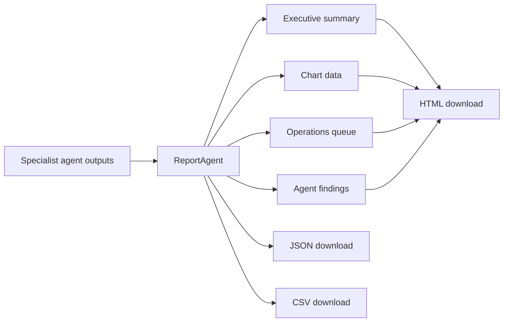

# MAFY Agentic Infrastructure

This document summarizes how MAFY uses agents to turn an anonymized sensitisation workbook into follow-up actions, scenario planning, and downloadable health operations reports.

The design goal is not to make the AI invent answers. The agents are grounded in workbook-derived metrics, deterministic scoring, anonymized aggregate payloads, and clear operational boundaries.

## System View

## Agent Roles

| Agent | Role | Output |
| --- | --- | --- |
| `CoordinatorAgent` | Selects and runs the required MAFY specialist workflow. | Plans, ordered agent results, structured response payloads. |
| `DataQualityAgent` | Reviews missing GPS, duplicate UID, and reliability signals. | Data quality findings and recommendations. |
| `OutreachAgent` | Measures outreach concentration and field activity load. | Outreach load metrics and findings. |
| `ReferralAgent` | Reviews referral activity and possible referral gaps. | Referral score findings and recommendations. |
| `RiskAgent` | Classifies operational risk intensity from outreach, referral, theme, and barrier signals. | Risk-intensity findings. |
| `FollowUpOperationsAgent` | Converts workbook evidence into current follow-up actions. | Field-ready action queue. |
| `WhatIfForecastAgent` | Runs probabilistic scenario forecasts for planning conversations. | Monte Carlo trajectories and animated race frames. |
| `ReportAgent` | Synthesizes agent outputs into report-ready narrative and export data. | Detailed report payload. |

## Operations Workflow

The operations workflow is used for real current actions. It does not simulate the future.

## What-if Forecast Workflow

The what-if workflow is explicitly probabilistic. It helps teams discuss possible pressure if a scenario is not prioritized, but it is not an operational fact or clinical prediction.

## Report Workflow

The report workflow packages the current MAFY evidence, specialist findings, chart data, and action queue into exportable formats for review and sharing.

## LLM Boundaries

The project can run without an LLM key. Deterministic scoring and Monte Carlo calculations still work.

When `OPENAI_API_KEY` is configured, the LLM is used for narrative support only:

- explaining current follow-up actions,
- explaining probabilistic what-if forecasts,
- improving report summary language.

Before LLM-facing payloads are built, sensitive workbook fields are removed, minimized, or pseudonymized. The LLM is not given raw staff names, exact GPS strings, raw free-text observations, raw participant questions, form links, or direct record identifiers.

## Safety Position

This is an M&E and operations assistant, not a clinical decision system.

- It does not diagnose patients.
- It does not infer confirmed disease burden.
- It does not replace local field review.
- It does not claim that Monte Carlo outcomes will happen.
- It supports prioritization, explanation, data quality review, and planning.

## Main API Surfaces

| Endpoint | Purpose |
| --- | --- |
| `GET /health` | Service health and LLM availability. |
| `GET /api/agents` | Lists coordinator and specialist agents. |
| `GET /api/dataset/summary` | Returns workbook summary and chart metrics. |
| `GET /api/dataset/anonymization-report` | Describes anonymization coverage. |
| `POST /api/operations/follow-up` | Runs current follow-up operations workflow. |
| `POST /api/forecast/what-if` | Runs Monte Carlo scenario forecasting workflow. |
| `POST /api/reports/detailed` | Runs detailed report workflow. |
| `POST /api/agents/run` | Generic coordinator entry point. |

## Pitch Summary

The agentic infrastructure is designed for trustworthy M&E assistance: deterministic analytics where decisions need evidence, optional LLM narrative where explanation helps humans, and clear scenario labeling where forecasting is probabilistic.
